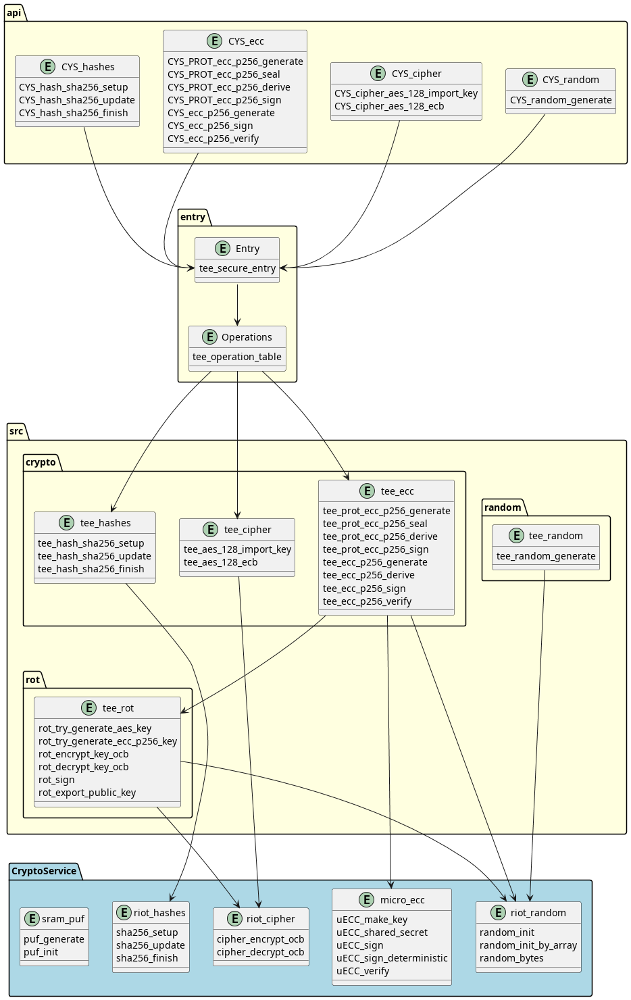

# RIOT-TEE

> Note: Very much work in progress, probably not usable for anyone else

> Warning, since someone has already forked this: In the current state I can make no guarantees for security. As of now it is completely untested. Please do not use this for anything safety or security related.

Secure Firmware for [RIOT OS](https://github.com/RIOT-OS/RIOT), for platforms with Trustzone-M support.

Currently only usable on nRF9160.

